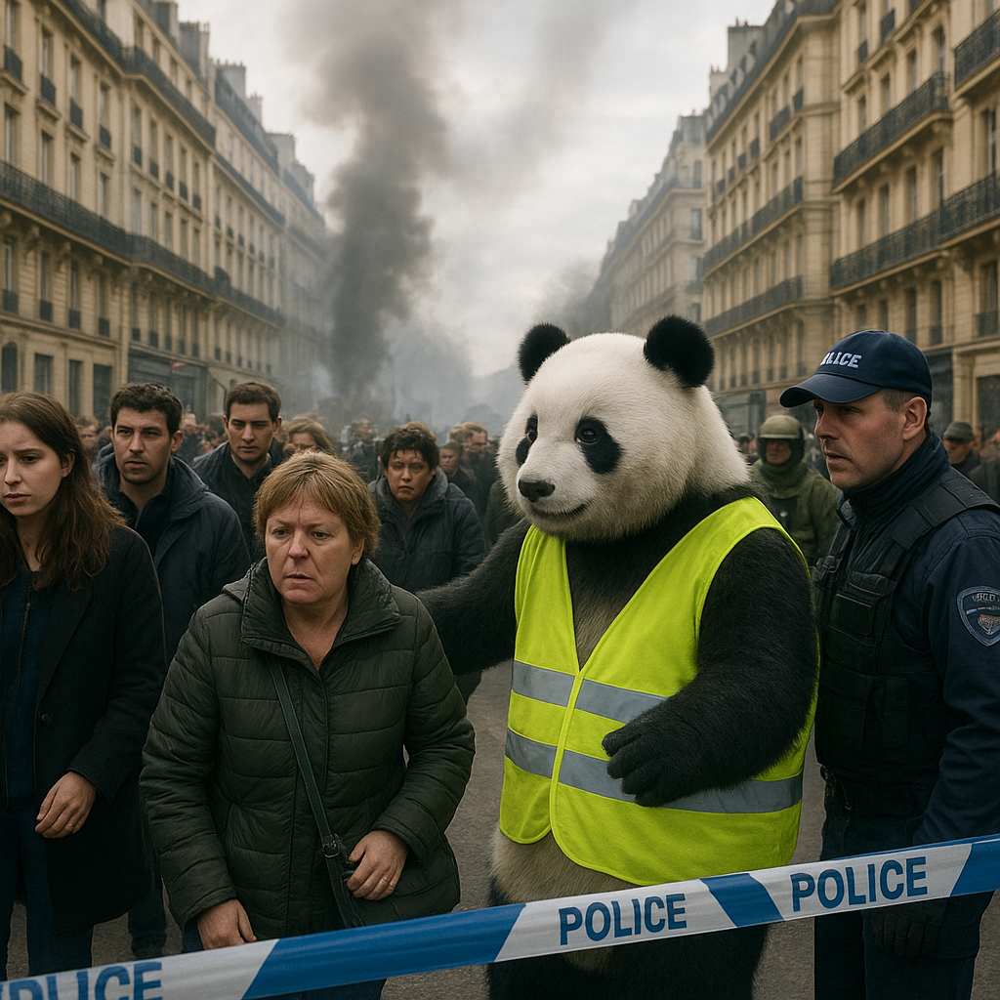

# Daily Panda Image Bot

This repo generates a daily panda image using OpenAI's **gpt-image-1-mini** model.
Every day it scrapes the top headlines from news orgs (BBC, Reuters, AP, NPR), picks the most visually interesting one, and uses **GPT-4o** to write a photorealistic image prompt with a panda as the main character.

Non-ASCII characters and incomplete sentences are automatically [cleaned up](src/daily_panda_image/utils/text_processor.py) before the prompt hits the image model.

The whole thing runs on a [GitHub Actions workflow](.github/workflows/image_publisher.yml) **CRON** that fires daily at 04:00 UTC (06:00 CEST).

## Today's Panda

**Prompt:** [US strikes Iranian fast boats as Iran attacks UAE oil facility, Strait of Hormuz]

A photorealistic image of a panda onboard a US-flagged commercial vessel, navigating through the strategic Strait of Hormuz at dawn. The panda, donned in a miniature naval uniform, is manning a radar station with intense focus as it scans for potential threats. Around it, the vessel's deck is bustling with activity: US Navy personnel in tactical gear, vigilant, against a backdrop of rising sunlight illuminating the distant rugged Iranian coastline. The scene captures realistic textures of the ship's metalwork, the panda's soft fur contrasting against the high-tech equipment.
